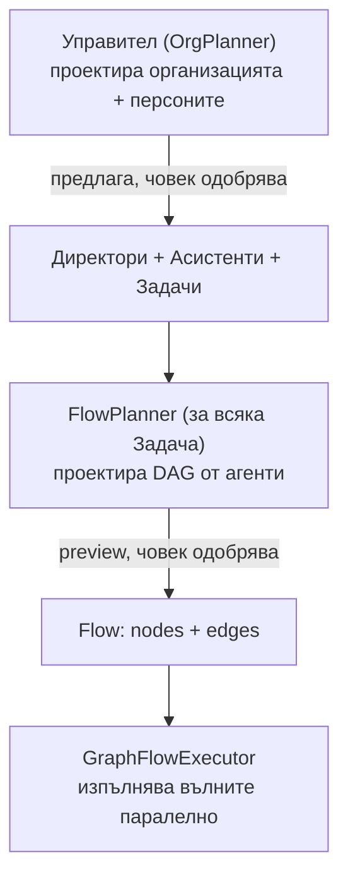
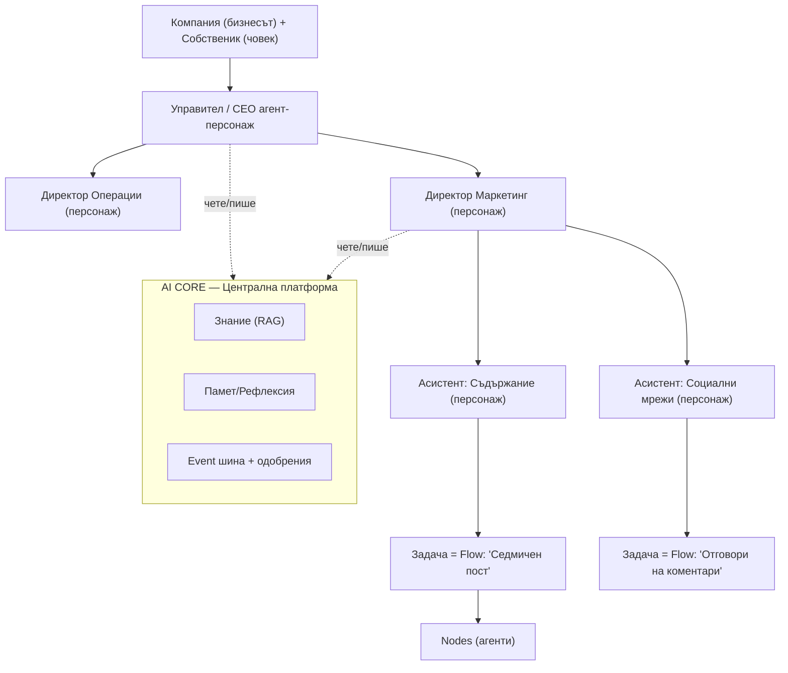
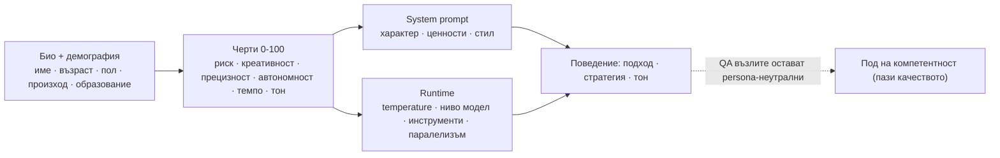
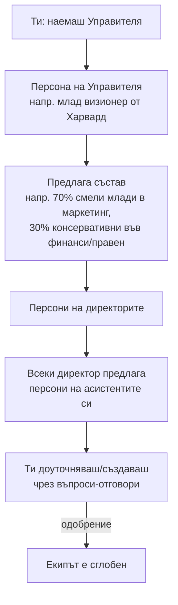
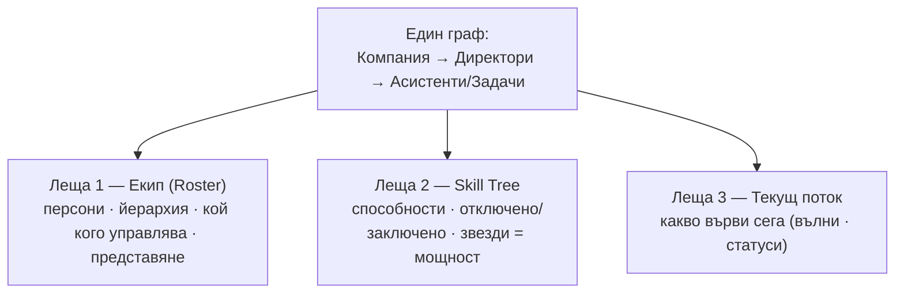
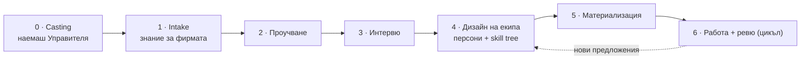
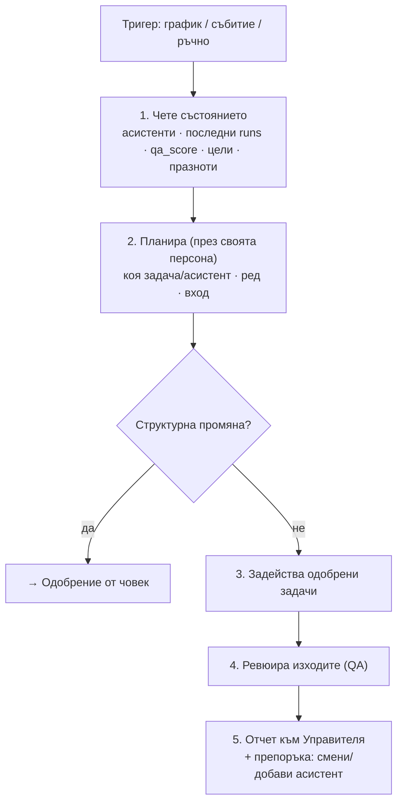
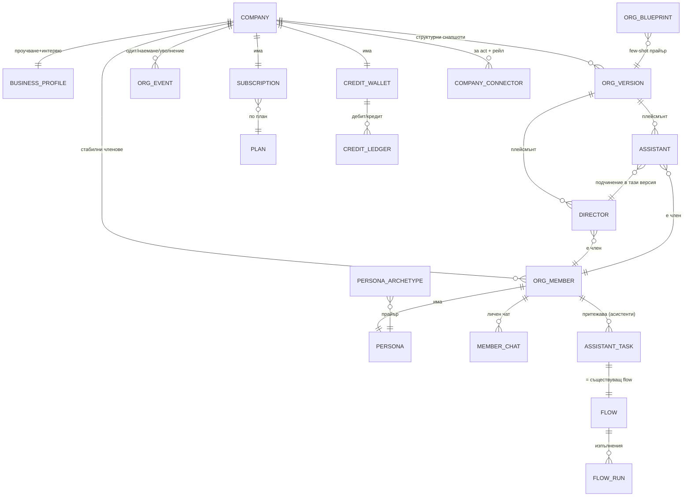

# AI Организация — „Управител, който създава фирма от агенти-персонажи"

> **Какво е това:** концепция за следващата голяма стъпка на FlowAI — над
> единичните flows да се построи цял **организационен слой с характер**: всеки
> регистриран бизнес получава **Управител** (силен агент-персонаж), който проучва
> бизнеса, интервюира собственика и проектира **организация от Директори →
> Асистенти → Задачи**, където всеки член е **персонаж с био и умения**, а всяка
> задача е flow от съществуващата система.
>
> Продуктът се представя като **мениджмънт/RPG игра за управление на твоята AI
> фирма** (вайб Football Manager / Crusader Kings / The Sims), но в **светла,
> професионална тема** и с реален бизнес фокус. Монетизация чрез **кредити-мощност с
> реален кредитен билинг foundation** (зареждане админ-симулирано засега, Stripe по-късно).
>
> **Статус:** идея за избистряне. Това НЕ е имплементационен план — това е
> концепцията, върху която после се пише планът (през Claude Code).

> ## Заключени решения (с потребителя, 2026-06-23)
>
> 1. **Автономност:** Управителят предлага → човек одобрява (на всяко ниво).
> 2. **Директорът** е реален разсъждаващ агент (не само групиране/табло).
> 3. **Изпълнение** смесено per-задача: `draft` (чернова) / `act` (действие през конектор) / `mixed`.
> 4. **Дизайн** тръгва от библиотека по вертикали + адаптация (не от нулата).
> 5. **Персона = био + RPG черти (stats) + runtime knobs.** Всеки член (Управител, Директори, Асистенти) има характер.
> 6. **Авторство на персоните:** Управителят предлага, ти доуточняваш/създаваш чрез въпроси-отговори.
> 7. **Демография** (възраст/пол/произход) НЕ управлява пряко, а **подсказва** чертите и личи ясно в тона/мисленето (20 vs 60 г.). Характерът оформя подхода, **не** компетентността (QA възлите са persona-неутрални).
> 8. **Бранд → RPG**, но светла тема + професионална презентация (надхвърля и заменя сегашния сдържан `PRODUCT.md`).
> 9. **Един граф, няколко лещи:** Екип (Roster) + Skill Tree (способности) + Текущ поток (live) са изгледи на един и същ граф.
> 10. **Монетизация:** кредити-мощност (звезди = ниво модел = цена в кредити) + абонаментни планове; **кредитен билинг foundation от старта** (wallet/ledger/метеринг/лимити, резервация+идемпотентност), зареждане през **админ симулация** засега, **Stripe по-късно** (drop-in зад `PaymentProvider`); отключване по готовност/план, не произволно.

---

## 1. Идеята с едно изречение

> Днес FlowAI има **„агент, който създава агенти"** (FlowPlannerService) — превръща
> текст в DAG от агенти. Сега добавяме **„агент, който създава организацията"**
> (Управителят) — превръща бизнеса в **екип от персонажи** (Директори/Асистенти), а
> всеки персонаж делегира задачите си обратно към стария планер.

Това е **рекурсия на вече доказан патърн**, само едно ниво по-нагоре, плюс
**характерен (RPG) слой** върху него и **монетизация** около него.

---

## 2. Какво вече имаме (и директно се преизползва)

~80% от градивните блокове съществуват.

| Нужда на новата визия | Вече съществува в кода |
|---|---|
| „Агент, който проектира агенти" | `FlowPlannerService` + `AgentGeneratorService` |
| Интервю на бизнеса с въпроси | Client portal **wizard** (`ClientFlowWizardService`, `FlowDraft`, `AgentLoop`) |
| Авто-проучване на бизнеса | research агенти (`DeepResearcherAgent`/`ResearcherAgent`/`MultiResearcherAgent`) + `BraveSearchService` + `CrawlService` + `GooglePlacesService` |
| „Знанието за фирмата" / памет на персонаж | **Knowledge base v2** (`KnowledgeService`) + `FlowMemoryService` |
| Изпълнение с паралелизъм / „Текущ поток" | `GraphFlowExecutor` + `NodeExecutorService` + Horizon |
| Few-shot „какво работи" → org + persona шаблони | `PlanLibraryService` / `plan_library` |
| Звезди ★ = мощност/цена на агент | `ModelLevel` (low→god) + `ModelRouterService` |
| Метеринг за билинг | `node_runs.cost_usd`, `App\Support\LlmUsage` |
| Агенти, които действат (`act`) + „Интеграции рейл" | **MCP конектори** (`company_connectors`, `McpClientService`) |
| Портретни аватари на персонажите (от демографията) | `ComfyUIService` (генерация на изображения) |
| Повтарящи се задачи | `RunScheduledFlows` + scheduling |

**Новото, което пишем:** мета-планерът (Управителят), моделът на организацията, **персона
двигателят**, **skill-tree/roster UI**, Директорът-агент, библиотеките от шаблони, чатът
с всеки член и **билинг слоят**.

---

## 3. Концептуален модел — три вложени планера

Йерархията на домейна:

„AI CORE / Централната платформа" (от мокъпите) **не е нов компонент** — това е
споделеното знание + памет + event/одобрение шината.

---

## 4. Продуктови решения (заключени)

Виж блока „Заключени решения" най-горе — десетте решения са в сила. Долу е
детайлът зад всяко.

---

## 5. Персоните — характерният двигател (RPG)

### 5.1 Какво е персона

Всеки член (Управител, Директор, Асистент) е **персонаж** с:
- **Самоличност (козметика):** име, **авто-генериран портретен аватар**, възраст, пол, етнос, произход, образование, кратко био/предистория. Портретът е „снимка на служителя", **генерирана от демографията** му от локалния `ComfyUIService` (фотореалистичен headshot), стабилно съхранена и **регенерирана само ако демографията се смени**. Чисто козметичен (визуална идентичност, не влияе на поведението — §5.3) и на **измислена персона** (без прилика с реални хора).
- **Черти (stats, 0–100):** риск, креативност, прецизност, автономност, темпо, тон.
- **Мандат и цели:** за какво отговаря, какво измерва успеха (KPI).

Това е вдъхновено от **Stanford „Generative Agents"** — агенти с памет, рефлексия и
устойчив характер.

### 5.2 Как персоната влияе на поведението

Чертите се „превеждат в стойности" на две места — system prompt + runtime knobs:

| Черта | System prompt | Runtime knob |
|---|---|---|
| Риск | колко смели предложения прави; склонност да ескалира | `approval_policy` агресивност |
| Креативност | разнообразие на идеите | по-висок `temperature` |
| Прецизност | повече самопроверка, по-малко рискове | по-нисък `temperature`, по-високо ниво модел за критични възли |
| Автономност | колко сам предлага vs изчаква | колко задачи задейства без питане (в рамките на одобреното) |
| Темпо | колко паралелно/често работи | паралелизъм, честота на ревюта |
| Тон | стил на изхода/чата (формален ↔ небрежен) | — (само презентация) |

### 5.3 Демография → черти (видим 20 vs 60), с предпазител

Демографията **не управлява пряко**, а **подсказва** стартови стойности на чертите и
тона: „24 г." → +креативност/+риск/по-небрежен тон; „59 г. ветеран" →
+прецизност/−риск/по-формален тон. Ти можеш да ги override-неш. Така **20-годишен и
60-годишен асистент се четат и мислят видимо различно**, но защото зад тях стоят
различни **черти**, а не зашито правило „възрастен = тесногръд".

**Два предпазителя (важни):**
1. **Характерът мени КАК, не КОЛКО добре.** Базовата компетентност е защитена — QA/верификационните възли се пускат persona-неутрални. „Импулсивен" директор взема по-смели решения, но не произвежда грешен резултат.
2. **Без стереотипи.** Пол/етнос остават предимно козметични (**портретен аватар**, име, тон); поведенческите ръчки са явните професионални черти, които ти контролираш. (Изследванията показват, че директното връзване на демография с разсъжденията внася bias и сваля точността.) Аватарът е визуалният израз на тази козметична идентичност — извежда се от демографията, не я надхвърля.

### 5.4 Casting на Управителя + каскада

Първо **наемаш Управителя** (избираш/генерираш негова персона). Неговият характер
после **каскадира** надолу:

Така един „млад Харвард визионер" реално ще предложи по-смел маркетинг екип, а
„опитен ветеран" — по-предпазлив. Това е твоят пример, превърнат в механика.

### 5.5 Авторство — Управителят предлага, ти доуточняваш

Управителят дава **чернова на всяка персона** (име, възраст, био, черти, тон) с
бизнес обосновка. Ти можеш да: приемеш; промениш полета/статове директно; отвориш
**Q&A**, за да я предефинираш; или създадеш съвсем нов член от нулата чрез въпроси.

### 5.6 Памет и рефлексия per член

Всеки член има **поток от памет** (преизползва `FlowMemoryService` + KB +
`node_runs` историята) и периодична **рефлексия**, която синтезира поуки (напр.
директор забелязва, че асистент се представя слабо → препоръчва смяна). Това е
патърнът на Generative Agents върху съществуващите services.

---

## 6. Един граф, няколко лещи (skill tree + roster)

Org-схемата и „skill tree"-ът от мокъпите **са един и същ граф, показан през различни
лещи.** Едни и същи възли: **клон = Директор, възел = Асистент/Задача.**

- **Roster (Екип)** — кой кого управлява, био, кой на кого дава отчети, кой следи кого, кой се справя и кой не. (Това, което поиска.)
- **Skill Tree (Способности)** — клонове по домейн, възли-умения; **звездите ★→★★★★★ = `ModelLevel`** (мощност + цена). Звездата на възела е тази на члена, освен ако задачата е override-ната (overridden възли се отбелязват различно от наследените). Какво е отключено, какво следва.
- **Текущ поток** — `FlowRun` вълните като живо табло „какво работи сега".

**Ключови механики от мокъпите, които приемаме:**
- **„Отключване = наемане на персонаж":** като отключиш умение (напр. „Reservations"), се ражда **Асистент с персона** (предложена от директора). Способността и характерът се раждат заедно.
- **Персонализирано дърво + куестове:** Управителят подрежда дървото по твоите нужди от проучването и слага препоръки: *„Отключи Reservations — губиш клиенти от липса на онлайн резервация."* Дървото не е генерично — приоритизирано е от ситуационния анализ.
- **Заключени бъдещи модули** (Финанси/HR/Правен/Логистика/IoT) = новите **Директори/отдели**, които Управителят предлага, щом бизнесът порасне.
- **Интеграции рейл** (CRM/Meta/Google/POS…) = MCP конекторите като видим „инвентар".
- **Нивото расте от реални резултати** (qa_score/KPI), не само от харчене — играта отразява истинско представяне.

---

## 7. Управителят (CEO) — поток

Силен модел (ниво `ultra`/`god`). Целият поток преизползва съществуващи services.

- **0 · Casting** — избираш персоната на Управителя (архетип или генериран).
- **1 · Intake** — форма + материали → knowledge base v2.
- **2 · Проучване** — сайт/уеб през research агенти (`DeepResearcherAgent`/`ResearcherAgent`/`MultiResearcherAgent`) + `BraveSearchService` + `CrawlService`, ревюта (`GooglePlacesService`), „чести практики в бранша" → ситуационен анализ.
- **3 · Интервю** — целенасочени въпроси (radio/checkbox + текст), спира при „ясна представа" (патърнът на client wizard-а).
- **4 · Дизайн** — взима org-шаблон по вертикала + persona архетипи и предлага Директори/Асистенти **с персони** + стартов skill tree.
- **5 · Материализация** (след одобрение) — записи + за всяка задача се вика `FlowPlannerService` (`AgentGenerationLauncher`).
- **6 · Работа + ревю** — виж §8 и §15.

---

## 8. Директорът като разсъждаващ агент (supervisor)

Персоната на директора **обагря** как преценява: смел директор бута по-агресивни
кампании; прецизен директор е по-строг към качеството. Може **сам** да подрежда и
пуска одобрени задачи, да ревюира, да отчита. **Изисква одобрение:** нов
асистент/задача, промяна на мандат, действие (`act`) с политика „питай".

---

## 9. Асистенти и Задачи

Асистентът е персонаж с мандат и набор задачи. **Задачата = Flow** + метаданни:

| Поле | Смисъл |
|---|---|
| `flow_id` | реалният DAG (от `FlowPlannerService`) |
| `trigger` | `manual` / `scheduled` / `event` |
| `act_mode` | `draft` / `act` / `mixed` |
| `approval_policy` | `auto` / `approve_each` / `approve_first_then_auto` |
| `star_tier` | ★→★★★★★ = `ModelLevel` (мощност + цена в кредити); **наследява нивото на члена по подразбиране**, освен ако е override-нато |
| `kpi` | мярка за успех |

**Наследяване на нивото (звездите).** По подразбиране задачата **наследява нивото (звездите)
на члена-собственик** — нивото живее на члена (рангът му), не на всяка задача. Можеш да
сложиш **per-task override**, когато конкретна задача трябва да е по-силна/по-слаба от
останалите. **Повишиш ли/понижиш члена**, всичките му задачи **без** override веднага минават
на новото ниво (и цената им в кредити се преоценява); задача с override остава фиксирана.
Над всичко важи **таванът на плана** (по-висок план → по-високи звезди). За **Директор** има
действие **„повиши целия отдел"**, което прилага нивото му към асистентите без ръчен override
и оттам към задачите им.

---

## 10. Динамична организация (наемане/уволнение по всяко време)

По всяко време можеш да **добавиш, промениш или махнеш** Директор или Асистент при
нова нужда. Директорите **препоръчват** смяна/добавяне на агенти (от рефлексията);
Управителят препоръчва нови отдели. Всичко минава през одобрение. Хире/файър/
преназначаване се записват като събития (за „хрониката").

---

## 11. Библиотеки от шаблони

- **`org_blueprints`** — org-структури по вертикала (директори, типични асистенти, типични задачи). Few-shot прайър за Фаза 4. Учи се (успешна → „proven"), като `plan_library`.
- **`persona_archetypes`** — типови персони по роля/вертикала („млад growth маркетинг", „ветеран финансов директор"). Захранват casting-а и предложенията.

Тръгваме с 3 seed вертикали (fitness/restaurant/services — спортен/фитнес център, ресторант, услуги/ремонти).

---

## 12. Чат с всеки член

Личен чат с **всеки** член (Управител, Директор, Асистент). Чатът е
**персона-консистентен** (в неговия тон, с **портретния му аватар** в интерфейса —
fallback инициали) и **скоупнат** към контекста му (мандат,
асистенти, задачи, последни runs, отчети, релевантно знание). Може да отговаря на
„какво се случва / какво препоръчваш / какво липсва" и да **предлага действия** (нова
задача, кампания, наемане) → които влизат в кутията за одобрения. Управител = стратегия;
Директор = домейн; Асистент = ниво задача.

---

## 13. Модел на одобрение (human-in-the-loop)

| Какво | Изисква одобрение? |
|---|---|
| Структура (нов член/задача/мандат, наемане/уволнение) | **Винаги** |
| Изпълнение на одобрена `draft` задача | Не — тече по график |
| Изпълнение на одобрена `act` задача | По `approval_policy` |
| Първо действие на нов конектор / висок риск (плащане, масов имейл) | **Винаги** |

UI: **„Кутия за решения"** — едно място за чакащите предложения (org-промени + действия).

---

## 14. Монетизация — кредити-мощност (кредитен foundation от старта; админ-симулирано зареждане сега, Stripe по-късно)

### 14.1 Икономическата реалност

Всяко пускане на агент струва реален inference. Локален агент (Ollama) ≈ ~0 за теб;
cloud флагман ≈ реални пари. Затова цената за клиента **следва употребата**.
Структурен плюс: routerът вече предпочита евтини/локални модели на ниски нива → **локалните
агенти са почти 100% марж**.

### 14.1.1 Бизнес модел — какво купуват клиентите

- Клиентът купува **ПЛАН** → получава **месечни кредити** + **`max_star_tier` таван** (докъдето
  стигат звездите му).
- **Звезди = мощност** (ниво модел, `ModelLevel`), **НЕ валута**. По-висок план → по-високи звезди.
- **Кредити = гориво** — харчат се **per пускане**: разход = **база(звезда) × работа** (множителят
  по нивото × свършените predict tokens). Един кредитен термин навсякъде; UI може да го нарича
  „токени" — същото.
- **Лимити** = кредитен **баланс** + **таван на плана** (`max_star_tier`); опционално брой членове/
  конектори.
- **На нула баланс → агентите спират** до зареждане или ъпгрейд (нищо не се пуска без покритие).
- **Зареждане** засега е **админ-симулирано** (админ зарежда кредити + слага план); Stripe по-късно.

### 14.2 Кредити + планове

- **Абонаментни планове** (Starter / Professional / Business / Enterprise) → всеки дава **месечен кредитен бюджет** + кои нива модел (звезди) са позволени (Starter — само евтини; Enterprise — до god).
- **Звезди = ниво модел (`ModelLevel`) = цена в кредити** на пускане. **5 нива = 5-те `ModelLevel`**: ★ = low ×1, ★★ = medium ×3, ★★★ = high ×6, ★★★★ = ultra ×12, ★★★★★ = god ×25. Цената на задачата ползва **наследеното от члена ниво** (или per-task override-а), ограничено от тавана на плана — виж §9.
- Кредит = `base(star_tier) × work(predict_tokens)`, където `base(star_tier)` е множителят по нивото (1/3/6/12/25) и `work = ceil(predict_tokens / 1000)`. Преди пускане → **резервация** на оценените кредити (атомарен wallet decrement с idempotency — за паралелните runs); след пускане → **реконсилиация** (delta debit или refund) от реалните токени. **Метерингът е върху `llm_requests` billable units** (всеки LLM request през `LlmUsage`/`LlmRequestRecorder`), НЕ само върху `FlowRun` — `FlowRun` е един контекст, не единственият (org планиране, интервю, research, директорски tick, членски chat, avatar, embeddings също харчат). Не-LLM инструменти (Brave/Places/OCR/ComfyUI аватар) → flat кредитни цени. Тези множители СЪВПАДАТ с `config/billing.php` (`low=1, medium=3, high=6, ultra=12, god=25`).

### 14.3 Марж и защита

- Цена на кредита за клиента > реален inference × надценка. Бюджетен **таван** per компания + **overage/top-up**. Планът определя макс. позволено ниво.
- RouterЪт, който оптимизира към локални/евтини модели, буквално пази маржа.

### 14.4 Отключване по готовност/план (не произволно)

- В рамките на плана **нищо не е изкуствено заключено** — „активираш" умение и то харчи кредити само когато върви.
- „Заключено" се пази за: (1) по-висок план (флагман агенти, цели бъдещи отдели); (2) реална неготовност — Управителят гейтва („отключи след свързване на календар"). Поднася се като **препоръка/куест**, не платена стена.

### 14.5 Билинг слой (ново)

Нови: `plans`, `subscriptions`, `credit_wallets` + `credit_ledger` (append-only, с
`type=reserve|settle|refund|topup|grant`) + **`credit_reservations`** (mutable състоянието на
една билинг-операция). Нов **context-agnostic** `CreditMeterService`
(`reserve(company, context, subject, estimate): CreditReservation` / `settle(reservation, actual)`
/ `refund(reservation)` — атомарен decrement + реконсилиация), който обвива съществуващия метеринг
(`LlmUsage`/`llm_requests`/`cost_usd`) през `BillableUnit`.

**Generic settle (не само за `FlowRun`).** Резервация/реконсилиация важат за **всеки** билинг
контекст (org планиране, интервю, research, чат, avatar, embeddings, task run) през един и същ
`CreditReservation`, а не само за flow run. Идемпотентността е **operation-scoped**: reserve / settle
/ refund са отделни ledger редове с отделни ключове (`"{reservation}:settle"` и т.н.), сочещи
`reservation_id` — retry/паралел не дебитира два пъти, а фазите не се сблъскват по общ ключ. Всеки
LLM request се атрибутира към текущата резервация (`reservation_id` през `LlmContext`), за да е
settle точен (вкл. FinalComposer-а на `finalize()`); failed/rejected/cancelled run settle-ва реалното
+ refund-ва остатъка (не изтича резерв).

**Кредитният билинг е foundation от старта** (wallet/ledger/метеринг/лимити, резервация +
идемпотентност работят реално веднага). Зареждането обаче е **админ-симулирано засега** —
админ зарежда кредити + слага план на фирмата, зад `PaymentProvider` интерфейс
(`AdminSimulatedPaymentProvider` сега). **Stripe е по-късен drop-in** (сменя се само binding-ът
на `PaymentProvider`) — реален auth е предусловие за него. Така кредитната машина е реална от
ден едно, без да чакаме платежна интеграция.

---

## 15. Живата организация (цикъл)

Периодично (`OrgReviewJob`) Управителят прави **ревю на представянето** (KPI, отчети,
празноти, qa_score трендове) и **предлага** промени: нов член/задача, пенсиониране на
слаб асистент, нов отдел, ескалация. Всичко през одобрение. Организацията се развива
с бизнеса; skill tree-ът „расте".

---

## 16. UI/UX — RPG бранд, светла тема

> **Брандът се завърта към мениджмънт/RPG игра** — това **надхвърля и заменя**
> сегашния сдържан `PRODUCT.md` („прецизен, спокоен, инструментален") и част от
> Impeccable анти-референциите. `PRODUCT.md` е пренаписан към RPG бранда ✓ (вече е готов).

**Нови предложени стълбове:** *жив, характерен, игрови — но четим и професионален.*
Запазваме оперативната яснота (моноширинни/tabular числа; статус = иконка+текст+цвят;
WCAG AA; reduced-motion). **Светла тема** — взимаме структурата и метафорите на
мокъпите, не неоновия фон. RPG-то е ангажиращата „кожа" върху сериозно ядро.

**Екрани:**
- **Щаб / Skill Tree** — живата способностна карта (клонове = директори; възли = умения със звезди; отключено/заключено; куестове от Управителя).
- **Roster / Org** — екипът като карти на герои (**авто-генериран портретен аватар** с fallback цветни инициали, име, титла, мини стат-барове, статус, текущ фокус), с видими линии „кой кого управлява / на кого отчита".
- **Карта на героя** — портретен аватар (fallback инициали; бутон „Регенерирай аватар"), био, статове (радар/барове), текущ куест (задача), последна активност, релации, бутони „Чат / Възложи / Преназначи / Освободи".
- **Наемане (Recruit)** — „интервю" поток: Управителят предлага кандидати с персони; ти избираш/доуточняваш.
- **Дневник на куестове (Задачи)** — задачите като куестове (статус, награда/KPI, изпълнител, прогрес); runs = „мисии в ход".
- **Текущ поток** — live pipeline (вълни/статуси).
- **Хроника** — „кой какво свърши" като лента/история на фирмата.
- **Кутия за решения** — одобрения (org-промени + действия).
- **Интеграции рейл** — конекторите като „инвентар".
- **Кредити & планове** — токени/звезди, разход, бюджет, ъпгрейд — професионално, с реални лв.

---

## 17. Домейн модел (скица)

Нови: `business_profiles`, **`org_members`** (стабилната идентичност — „служителят за
цял живот": `company_id`, `kind=manager|director|assistant`, `key`; носи персона/чат/
памет/представяне и — за асистенти — задачите; преживява версиите), `org_versions`
(структурни снапшоти за атомарно одобрение/история/rollback), `directors` и `assistants`
(**плейсмънт редове** в дадена версия: `org_version_id` + `org_member_id`, сочещи стабилния
член = ролята/мястото му В ТАЗИ версия; асистентът сочи и своя директор), `assistant_tasks`
(висят на стабилния `org_member_id` на асистента), `personas` (на член — висят на
`org_member_id`; полета: име/аватар-полета (url/prompt/seed/status/meta — портрет от
демографията)/възраст/пол/етнос/произход/образование/био/черти-json/тон/derived-knobs-json),
`member_chats` + `member_messages` (на `org_member_id`), `org_events`, `org_blueprints`,
`persona_archetypes`, `plans`, `subscriptions`, `credit_wallets`, `credit_ledger`.
Управителят е `org_member` с `kind=manager` (няма отделна `managers` таблица; персоните не
са полиморфни — висят само на `org_member_id`). Преизползвани без промяна: `flows*`,
`flow_runs`, `node_runs`, `knowledge_*`, `plan_library`, `flow_memories`,
`company_connectors`.

---

## 18. Преизползване: стар компонент → нова роля

| Съществуващо | Нова роля |
|---|---|
| `FlowPlannerService` | планер на **една задача** (вика се на Фаза 5) |
| `OrgPlannerService` *(ново)* | планерът на организацията + персоните (Управителят) |
| Client wizard | машината за **интервюто** + Q&A авторство на персони |
| research агенти (`DeepResearcherAgent`/`ResearcherAgent`/`MultiResearcherAgent`) + `BraveSearchService` + `CrawlService` + `GooglePlacesService` | **проучването** (Фаза 2) |
| Knowledge base v2 + `FlowMemoryService` | памет/рефлексия per персонаж |
| `plan_library` | модел за `org_blueprints` + `persona_archetypes` |
| `ModelLevel` / `ModelRouter` | **звездите** (мощност/цена) + защита на маржа |
| `node_runs.cost_usd` / `LlmUsage` | **метеринг за кредити/билинг** |
| MCP конектори | `act` задачи + **интеграции рейл** |
| `ComfyUIService` | **портретни аватари на членовете** (`buildWorkflow`→`generate`→`getResult`, стабилен път), генерирани от демографията |
| Horizon + scheduling | паралелна и периодична работа |

---

## 19. С какво се различава от пазара

- **MetaGPT** — фиксирани роли (само софтуерна фирма). Ние сме vertical-agnostic.
- **CrewAI** — мощен, но дефинираш екипа ръчно. Нашата организация се проектира сама.
- **Lindy / Relevance AI** — „AI служители", но пак ръчна настройка.
- **Stanford Generative Agents** — академичната основа за персонажи с памет/характер; ние я прилагаме към реален бизнес.

Уникалното комбо: **самопроектираща се организация от персонажи с характер, обоснована
от реално проучване, представена като мениджмънт игра, с прозрачни кредити/цена на
всяко ниво.**

---

## 20. Рискове и отворени въпроси

- **Цена/марж** — много агенти × runs. Митигация: локални за рутинно, кредитен таван, router оптимизация.
- **Сигурност на `act`** — виж `MCP-CONNECTORS.md`. Митигация: степенувано одобрение + одит.
- **`act` под preview auth** — клиентската preview аутентикация е passwordless; реален write през
  конектор без истински auth е риск. Митигация: **act hard gate** — `act` (write) е **изключен по
  подразбиране** (`ORG_ACT_ENABLED=false`) докато няма реален auth; в preview режим act задачите дават
  **„чернова на действието"** за човека, без реален страничен ефект. Реалният auth е предусловие за
  включване на `act` (и за Stripe — Фаза 6).
- **Halucinирана организация/персони** — митигация: шаблони + критика + човешко одобрение.
- **Persona drift** — характерът да „избяга" с времето. Митигация: персоната, пинната в system prompt + периодична рефлексия.
- **Bias от демография** — митигация: козметика + явни черти; QA persona-неутрален (§5.3).
- **Портретни аватари** — на **измислени персони** (без прилика с реални хора; генерирани от демографията, не от снимки); при спрян ComfyUI — graceful offline fallback (цветни инициали + по-късен retry), без да блокира организацията.
- **Качество ≠ характер** — „мързелив" персонаж да не значи лош резултат: под на компетентност (QA).
- **Билинг сложност** — кредитната машина е foundation от старта (реална), но ДДС/фактури/Stripe се **отлагат** (Stripe е по-късен drop-in; засега админ-симулирано зареждане). Отделна валидация при включването на Stripe (не финансов съвет).
- **Бранд пивот** — да не изгубим четимостта на данните в полза на украса.
- **Решени (с потребителя):**
  - Директори/асистенти на `Company` или през `org_versions`? → **РЕШЕНО: хибрид** — стабилни `org_members` (идентичност за цял живот) + версионирани плейсмънти (`directors`/`assistants` в `org_versions`).
  - Точна кредитна формула? → **РЕШЕНО** (виж §14.2 / плана): `credits = base(star_tier) × ceil(predict_tokens / 1000)`, множители 1/3/6/12/25.
  - Кои вертикали seed-ваме? → **РЕШЕНО: 3** (fitness/restaurant/services).
  - Колко лениво се генерират flows? → **РЕШЕНО: по заявка** (план Фаза 3); при директор-tick липсващ flow се авто-генерира преди run.
  - Плащания от старта? → **РЕШЕНО: кредитен foundation реален от старта** (wallet/ledger/метеринг/резервация+идемпотентност); зареждане **админ-симулирано** засега зад `PaymentProvider`; **Stripe по-късно** (drop-in, реален auth е предусловие).

---

## 21. Фазиран роадмап (MVP → пълно)

| Фаза | Какво | Преизползва |
|---|---|---|
| **0** | Домейн модел + seed org-шаблони + persona архетипи + **plans/credits скелет** | `plan_library`, `ModelLevel` |
| **0.5** | **Изпълнение + билинг foundation**: метеринг (`llm_requests`/`BillableUnit`) + кредитна резервация/реконсилиация/идемпотентност (`CreditMeterService`) + `PaymentProvider`/`AdminSimulated` + persona injection в runtime + generation state machine + Decision Box адаптер + queue topology | `LlmUsage`/`LlmRequestRecorder`, `GraphFlowExecutor`, `NodePromptBuilder`, `FlowRunController::approval` |
| **1** | Casting на Управителя + Intake + проучване + интервю → Бизнес профил | wizard, research агенти + Brave/Crawl/Places, KB |
| **2** | Дизайн на екипа **с персони** + **Skill Tree/Roster UI** + одобрение → материализация | `OrgPlannerService` (ново) |
| **3** | Задачи = flows; генериране per асистент; ръчно пускане; **Текущ поток** | `FlowPlannerService`, run екрани, **wallet гейт (Фаза 0.5)** |
| **4** | Директор-агент (рутиране, ревю, отчети, препоръки) + график + кутия за решения + **чат с членове** | `DirectorAgentService` (ново) |
| **5** | `act` задачи през конектори + интеграции рейл + политики на одобрение | MCP конектори |
| **6** | **Stripe drop-in** (заменя админ top-up) + абонаментен UI/overage + отключване по план | `BillingService` (ново), `PaymentProvider` |
| **7** | Жива организация: периодично ревю, рефлексия/памет per член, динамично наемане/уволнение, хроника | `OrgReviewJob`, `FlowMemory` |

> Бел.: **Фаза 0.5 (execution/billing foundation) идва преди UI-тежките фази** — реалната
> кредитна машина (метеринг → резервация → реконсилиация) гейтва всяко пускане от ден едно,
> със **админ-симулирано зареждане**. **Stripe (Фаза 6) е по-късен drop-in** зад
> `PaymentProvider` — само сменя откъде идват кредитите, когато има какво да се продава и има
> реален auth.

MVP-демо = Фази 0–3 (наемаш Управител → проучен → интервюиран → екип с персони и skill
tree → одобрен → една задача дава резултат).

---

## 22. Речник

- **Управител (CEO агент)** — мета-планерът-персонаж; проектира и развива организацията.
- **Директор** — разсъждаващ агент-персонаж за домейн; рутира, ревюира, отчита.
- **Асистент** — персонаж с мандат; притежава задачи.
- **Задача** — единица работа = **Flow**.
- **Персона** — био + черти (stats) + knobs на член.
- **Черта (stat)** — професионален параметър 0–100 (риск, креативност…).
- **Звезда ★** — ниво на модел (`ModelLevel`, 5 нива ★→★★★★★) = мощност + цена в кредити. Нивото живее на **члена** (рангът му); **задачата наследява звездата на члена**, освен ако не е изрично override-ната, и накрая се ограничава от тавана на плана.
- **Кредит** — единица разход, мапната към inference цена.
- **Куест** — препоръчано умение/задача от Управителя.
- **Хроника** — лента „кой какво свърши".

---

## 23. Приложение: Game Sport Center, разигран

1. **Casting:** наемаш Управител „Алекс, 28, визионер" (висок риск/креативност).
2. **Intake + проучване:** сайт, Google ревюта, „как работят успешни груп-фитнес центрове" → слаби места: няма онлайн резервация, нередовни постове.
3. **Интервю:** „Кое боли най-много — пълнота на класовете, задържане, нови клиенти?" → „задържане + пълнота".
4. **Дизайн (предложен, ти одобряваш):** Алекс предлага състав — **смел млад Маркетинг** (Мартин, 24) + **прецизен Финансов** (г-н Петров, 59); Директори Операции, Клиентско, Маркетинг, Данни, Тренировъчен. Skill tree с куест „Отключи Reservations".
5. **Материализация:** „Седмичен пост" (★★, `draft`) и „Напомняния за резервации" (★★★, `act`, `approve_first_then_auto`) стават реални flows.
6. **Работа:** Директор Маркетинг (през своята смела персона) пуска „Съдържание", ревюира, отчита. Чатваш Мартин: „какво да пуснем тази седмица?" — отговаря в своя дързък тон. Кредитите се харчат прозрачно; нивото расте с резултатите.
7. **Цикъл:** Алекс месечно предлага „Добави Асистент Лоялност?" → одобряваш.

---

## Следваща стъпка

Този документ е концепцията. **Имплементационният план фаза по фаза** — миграции,
services, routes, сигнатури, критерии за приемане — е готов в
[`AI-ORGANIZATION-IMPLEMENTATION-PLAN.md`](./AI-ORGANIZATION-IMPLEMENTATION-PLAN.md) (по
модела на `docs/CLIENT-PORTAL-PLAN.md`). **`PRODUCT.md` е пренаписан към новия RPG бранд ✓.**

---

### Източници (пазарен/академичен контекст)

- Stanford „Generative Agents" (памет, рефлексия, характер): https://hai.stanford.edu/news/computational-agents-exhibit-believable-humanlike-behavior
- Persona/role prompting (ефект върху креативност/решения + bias): https://www.prompthub.us/blog/role-prompting-does-adding-personas-to-your-prompts-really-make-a-difference
- MetaGPT (фиксирани роли „софтуерна фирма"): https://www.ibm.com/think/topics/metagpt
- CrewAI hierarchical / manager агент: https://docs.crewai.com/en/learn/hierarchical-process
- AI workforce / „AI служители": https://www.lindy.ai/blog/ai-workforce
