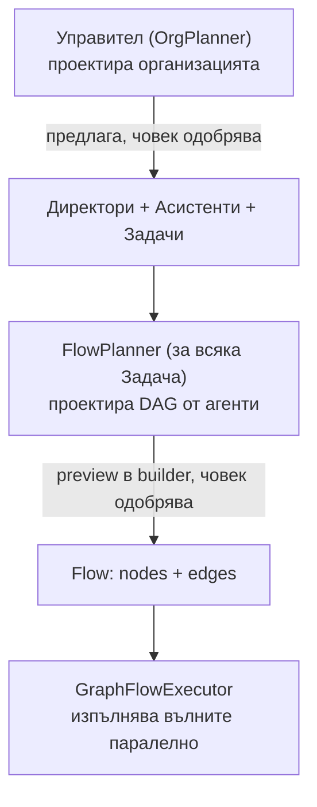
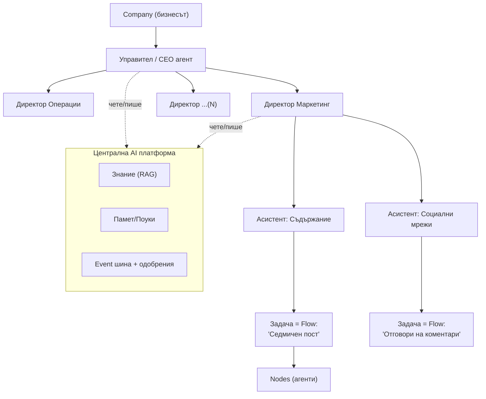
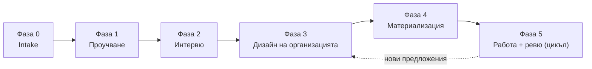
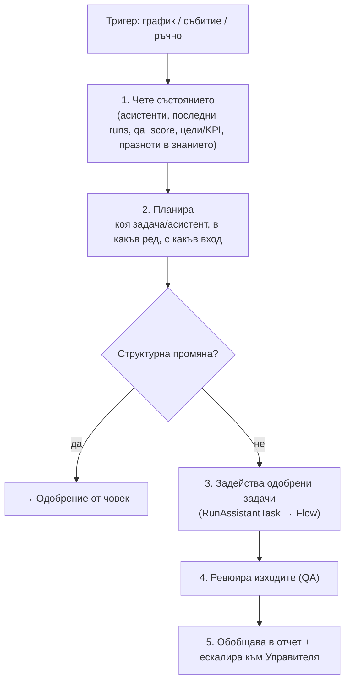
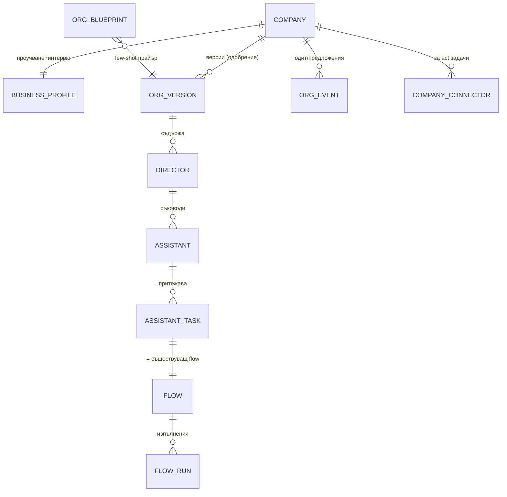

# AI Организация — „Управител, който създава фирма от агенти"

> **Какво е това:** концепция за следващата голяма стъпка на FlowAI — над
> единичните flows да се построи цял **организационен слой**: всеки регистриран
> бизнес получава **Управител** (силен агент), който проучва бизнеса, интервюира
> собственика, и проектира организация от **Директори → Асистенти → Задачи**,
> където всяка задача е flow от съществуващата система.
>
> **Статус:** идея за избистряне. Това НЕ е имплементационен план — това е
> концепцията, върху която после се пише планът (през Claude Code).
>
> **Решения (заключени с потребителя, 2026-06-23):**
> 1. Автономност: **Управителят предлага → човек одобрява** (на всяко ниво).
> 2. Директорът е **реален разсъждаващ агент** (не само групиране/табло).
> 3. Изпълнение: **смесено per-задача** — едни задачи действат (конектори), други само произвеждат чернова.
> 4. Дизайнът тръгва от **библиотека от вертикали + адаптация** (не от нулата).

---

## 1. Идеята с едно изречение

> Днес FlowAI има **„агент, който създава агенти"** (FlowPlannerService) — превръща
> текст в DAG от агенти. Сега добавяме **„агент, който създава организацията"**
> (Управителят) — превръща бизнеса в DAG от *роли* (Директори/Асистенти), а всяка
> роля делегира задачите си обратно към стария планер.

Това е **рекурсия на вече доказан патърн**, само едно ниво по-нагоре. Не строим нова
система — добавяме мета-слой над работещото ядро.

---

## 2. Какво вече имаме (и директно се преизползва)

Това е най-силната част: ~80% от градивните блокове съществуват.

| Нужда на новата визия | Вече съществува в кода |
|---|---|
| „Агент, който проектира агенти" | `FlowPlannerService` (3-фазен planner) + `AgentGeneratorService` |
| Интервю на бизнеса с въпроси | Client portal **wizard** (`ClientFlowWizardService`, `FlowDraft`, `AgentLoop`, radio/checkbox + „пълна картина") |
| Авто-проучване на бизнеса | `website-researcher` (map-reduce multi-agent), `BraveSearchService`, `GooglePlacesService` (ревюта), `CrawlService` |
| „Знанието за фирмата" | **Knowledge base v2** (`KnowledgeService`, ingest/facts/gaps, RAG) |
| Изпълнение с паралелизъм | `GraphFlowExecutor` + `NodeExecutorService` + Horizon |
| Памет между изпълнения | `FlowMemoryService` (поуки, дедуп) |
| Few-shot „какво работи" | `PlanLibraryService` / `plan_library` (proven планове) |
| Цена/качество на ниво | `ModelLevel`, `ModelRouterService`, `node_runs.qa_score`, `cost_usd` |
| **Агенти, които действат** | **MCP конектори** (`company_connectors`, `McpClientService`, `FlowNode type=mcp_action`) |
| Повтарящи се задачи | `RunScheduledFlows` + scheduling |
| Одит на генерациите | `AgentGenerationLog` |

**Новото, което пишем:** мета-планерът (Управителят), моделът на организацията
(Директори/Асистенти/Задачи), Директорът-агент, библиотеката от org-шаблони, и
UI-ят за org chart + одобрение.

---

## 3. Концептуален модел — три вложени планера

Системата е **три вложени нива на планиране**, всяко предлага, човек одобрява:

Йерархията на домейна:

„Централната AI платформа" от твоята схема **не е нов компонент** — това е
споделеното знание (knowledge base v2) + памет (FlowMemory) + event/одобрение
шината, които свързват всички роли.

---

## 4. Продуктови решения (заключени)

**4.1 Автономност: предлага → одобряваш.** Управителят и Директорите никога не
променят структурата мълчаливо. Всяка *структурна* промяна (нов директор, нов
асистент, нова задача, променен мандат) минава през **одобрение**. Веднъж одобрени,
задачите се изпълняват по графика си — човекът вече ги е одобрил.

**4.2 Директорът е реален агент.** Не е просто папка. Той разсъждава: решава коя
задача кога да задейства, ревюира качеството на изходите, обобщава в отчет и
ескалира проблеми към Управителя. Това е индустриалният **supervisor / hierarchical
agent teams** патърн.

**4.3 Изпълнение смесено per-задача.** Всяка задача носи `act_mode`:
- `draft` — само произвежда (текст/анализ/дизайн); човекът изпълнява навън.
- `act` — действа върху реална система през MCP конектор (пост, резервация, имейл).
- `mixed` — част произвежда, част действа.

Действащите стъпки носят **политика на одобрение** (виж §9) — по подразбиране
„чернова + питай", защото §4.1.

**4.4 Дизайн от библиотека.** Управителят тръгва от **org-шаблон по вертикала**
(спорт, ресторант, ремонти, изкуство…) и го **адаптира** към конкретния бизнес от
проучването. По-бързо, по-предсказуемо, и се учи (както `plan_library` за flows).

---

## 5. Управителят (CEO) — петфазен поток

Управителят е **силен модел** (ниво `ultra`/`god`, виж `ModelLevel`). Целият му
поток преизползва вече съществуващи services.

**Фаза 0 — Intake (бизнесът се описва).** Регистрация + форма: вид бизнес, уебсайт,
социални профили, локации, качени материали (ценоразпис, меню, договори…). Всичко
влиза в **knowledge base v2** като „знанието за фирмата". *Преизползва:*
`KnowledgeIngestor`, ingest jobs.

**Фаза 1 — Автономно проучване.** Управителят пуска изследване: обхожда сайта
(`website-researcher` map-reduce), вади ревюта (`GooglePlacesService`), търси в уеб
(`BraveSearchService`) конкуренти и „чести практики в този бранш". Резултат:
**Бизнес профил + ситуационен анализ** (какво е бизнесът, оферти, аудитория, канали,
силни/слаби страни, разлики спрямо добрите практики). *Преизползва:* целия research
стек + KB facts.

**Фаза 2 — Интервю.** Управителят задава целенасочени въпроси (radio/checkbox + „Друго"
+ свободен текст), за да запълни празнотите: цели, болки, какво да се подобри/добави,
какво не е наред, приоритети, бюджет/апетит (= ниво на модела), ограничения. Спира,
когато има „ясна представа" (чеклист за пълнота). *Преизползва:* **точно** патърна на
client wizard-а (`AgentLoop` + token-poll + структуриран JSON), само че целта е
org-дизайн, не един flow.

**Фаза 3 — Дизайн на организацията.** Управителят взима най-близкия **org-шаблон по
вертикала** от библиотеката (few-shot) и го адаптира: предлага списък **Директори**,
за всеки — **Асистенти**, за всеки асистент — стартов набор **Задачи** (с кратко
описание, тригер и `act_mode`). Връща структуриран JSON (Structured Outputs, както
planner-а). *Ново:* `OrgPlannerService`. *Преизползва:* идеята на `FlowPlannerService`
+ `plan_library`.

**Фаза 4 — Материализация (след одобрение).** Одобрената организация → записи
`Director`/`Assistant`/`AssistantTask`. За всяка задача се вика **съществуващият**
`FlowPlannerService`, за да се генерира реалният flow (лениво при първо пускане или
веднага). *Преизползва:* `AgentGenerationLauncher` (вече изнесен за client портала).

**Фаза 5 — Работа + ревю.** Виж §6 и §10.

---

## 6. Директорът като разсъждаващ агент (supervisor)

Директорът се „събужда" по тригер (график, събитие, ръчно) и изпълнява кратък
разсъждаващ цикъл върху **своя домейн**:

Какво **може сам** (в рамките на одобрения мандат): да подрежда и пуска вече
одобрени задачи, да ревюира качество, да пише отчети. Какво **изисква одобрение**:
нов асистент/задача, промяна на мандат, или действаща (`act`) стъпка с политика
„питай". Моделът на Директора е конфигурируем (по подразбиране среден-силен;
маршрутизира се през `ModelRouterService`).

*Ново:* `DirectorAgentService` (тънък agent-loop отгоре на съществуващите tools и
телеметрия). *Преизползва:* `node_runs.qa_score`, `FlowMemoryService`, `AgentLoop`.

---

## 7. Асистенти и Задачи

**Асистентът** е именована, постоянна роля с мандат, собствен срез от знание и набор
от задачи. Той е тънка обвивка — реалната работа е в задачите.

**Задачата = Flow** (съществуващият модел). Новото е метаданните около нея:

| Поле | Смисъл |
|---|---|
| `flow_id` | реалният DAG (генериран от `FlowPlannerService`) |
| `trigger` | `manual` / `scheduled` (cron) / `event` (напр. ново ревю, нов лийд) |
| `act_mode` | `draft` / `act` / `mixed` (§4.3) |
| `approval_policy` | `auto` / `approve_each` / `approve_first_then_auto` (§9) |
| `kpi` | какво измерва успеха (брой постове, време за отговор, конверсия…) |

Пример от спортния център: „Система за резервации и напомняния" = `scheduled` +
`act` (праща напомняния през конектор, политика `approve_first_then_auto`); „Седмичен
пост" = `scheduled` + `draft` (произвежда пост, човек го публикува, или `act` ако е
свързан социален конектор).

---

## 8. Библиотека от вертикали (org blueprints)

`org_blueprints` е за организацията това, което `plan_library` е за flows: набор от
**одобрени org-структури по бранш** (директори, типични асистенти, типични задачи),
които служат като few-shot прайъри за Фаза 3. Тръгваме с 2–3 seed вертикали (напр.
спортен/фитнес център, ресторант, услуги/ремонти) и библиотеката **се учи**: успешно
работеща, одобрена организация се промотира към „proven" и захранва бъдещи дизайни —
точно като жизнения цикъл на `plan_library`.

Това дава баланса: предсказуема скелетна структура + адаптация към конкретиката от
проучването.

---

## 9. Модел на одобрение (human-in-the-loop)

Понеже §4.1, одобрението е навсякъде, но **степенувано**, за да не дави потребителя:

| Какво | Изисква одобрение? |
|---|---|
| Структура (нов директор/асистент/задача, мандат) | **Винаги** |
| Изпълнение на одобрена `draft` задача | Не (безопасно) — тече по график |
| Изпълнение на одобрена `act` задача | По `approval_policy` на задачата |
| Първо действие на нов конектор / висок риск (плащане, масов имейл) | **Винаги** (по подразбиране) |

UI: **„Кутия за одобрения"** — едно място, където чакат предложенията на Управителя
и Директорите (org-промени + действия за потвърждение). Одобряваш/редактираш/отказваш.

---

## 10. Живата организация (непрекъснат цикъл)

Това е, което прави визията жива, а не еднократен генератор. Периодично
(`OrgReviewJob`, по график) Управителят прави **ревю на представянето**: чете KPI,
отчетите на директорите, празнотите в знанието, трендовете на `qa_score` → и
**предлага** промени: нов директор/асистент/задача, пенсиониране на слаб асистент,
промяна на мандат, ескалация на проблем. Всичко минава през одобрение (§9). Така
организацията се развива с бизнеса.

---

## 11. Домейн модел (скица)

Нови таблици (точните схеми се финализират в имплементационния план):

- `business_profiles` — ситуационният анализ (summary, SWOT, цели, статус).
- `org_versions` — снапшот на организацията за ревю/одобрение (огледало на `flow_versions`: draft → proposed → approved → active, `model_level`).
- `directors` — име, домейн, мандат, цели/KPI, модел, статус.
- `assistants` — име, роля, мандат, срез от знание, модел, статус.
- `assistant_tasks` — виж §7 (връзка към `flows`).
- `org_blueprints` — библиотеката по вертикали (§8).
- `org_events` — append-only одит на предложения/одобрения/ескалации.

**Преизползвани без промяна:** `flows`, `flow_nodes`, `flow_edges`, `flow_runs`,
`node_runs`, `knowledge_*`, `plan_library`, `flow_memories`, `company_connectors`.

---

## 12. UI повърхности

- **Boardroom (чат с Управителя)** — където тече интервюто (Фаза 2) и където
  говориш с CEO агента. Преизползва wizard UI патърна.
- **Org chart изглед** — живата версия на твоята схема: директори/асистенти като
  възли, drill-down към задачите. Тук ревюираш и одобряваш Фаза 3. Може да е същата
  Drawflow технология или по-просто дърво.
- **Табло на Директор** — асистенти, задачи, KPI, последни runs, отчети, чакащи
  предложения.
- **Кутия за одобрения** (§9).
- **Детайл на Задача/Асистент** — преизползва съществуващите flow/run/result екрани.

Всичко това седи естествено върху **client портала** (вече има auth, layout, run-poll).

---

## 13. Преизползване: стар компонент → нова роля

| Съществуващо | Нова роля в AI Организацията |
|---|---|
| `FlowPlannerService` | планер на **една задача** (извиква се от Управителя на Фаза 4) |
| `OrgPlannerService` *(ново)* | планер на **организацията** (Управителят) |
| Client wizard | машината за **интервюто** на Управителя |
| `website-researcher` + Brave + Places | **автономното проучване** (Фаза 1) |
| Knowledge base v2 | „знанието за фирмата" + общата памет на платформата |
| `plan_library` | модел за **`org_blueprints`** (библиотека по вертикали) |
| `FlowMemoryService` | поуки на ниво задача; разширява се до org-ниво |
| MCP конектори | **действащите** (`act`) задачи |
| `ModelLevel` / `ModelRouter` | силен модел за Управителя, евтини за рутинните задачи |
| Horizon + scheduling | паралелна и периодична работа на асистентите/директорите |

---

## 14. С какво се различава от пазара

- **MetaGPT** — фиксирани роли (само софтуерна фирма). Ние сме vertical-agnostic.
- **CrewAI** — мощен, но искаш да си **дефинираш ръчно** екипа и процеса. Нашата
  организация се **проектира сама** от проучване + интервю.
- **Lindy / Relevance AI** — „AI служители", но пак ръчна настройка на всеки агент.
  При нас Управителят сглобява целия отдел и го свързва със знанието на фирмата.

Уникалното комбо: **самопроектираща се организация, обоснована от реално проучване и
интервю, за всякаква вертикала, с прозрачна цена/качество на всяко ниво** (силата,
която FlowAI вече има на ниво flow, изнесена на ниво фирма).

---

## 15. Рискове и отворени въпроси

- **Цена.** Десетки агенти × периодични runs могат да станат скъпи. Митигация:
  Управителят е силен, но рядък; рутинните асистенти — евтини/локални; бюджетни
  тавани per организация.
- **Сигурност на действията.** `act` през конектори може да навреди (виж
  предупрежденията в `MCP-CONNECTORS.md`). Митигация: степенувано одобрение (§9),
  одит (`org_events`, `connector_tool_logs`).
- **Halucinирана организация.** Управителят може да предложи безсмислени роли.
  Митигация: библиотека от вертикали като скелет + критика-фаза + човешко одобрение.
- **Runaway цикли.** Директори/Управител, които предлагат безкрай. Митигация: лимити
  на предложения per ревю, cooldown, всичко зад одобрение.
- **Качество на български.** Запазваме BgGPT патърна за български прозаични агенти.
- **Отворени въпроси за плана:** трябва ли `org_versions` или директорите/асистентите
  висят директно на `Company`? Колко „лениво" се генерират flows? Как изглежда KPI
  моделът конкретно? Кои 2–3 вертикали seed-ваме първи?

---

## 16. Фазиран роадмап (MVP → пълно)

| Фаза | Какво | Преизползва |
|---|---|---|
| **0** | Домейн модел + seed на 2–3 org-шаблона | `plan_library` патърн |
| **1** | Управител: проучване + интервю → Бизнес профил | wizard, website-researcher, KB |
| **2** | Дизайн на организацията + одобрение (org chart UI) → материализация на директори/асистенти | `OrgPlannerService` (ново) |
| **3** | Задачи = flows; генериране per асистент; ръчно пускане | `FlowPlannerService`, run/result екрани |
| **4** | Директор-агент (рутиране, ревю, отчети) + график + кутия за одобрения | `DirectorAgentService` (ново), scheduling |
| **5** | Действащи (`act`) задачи през конектори + политики на одобрение | MCP конектори |
| **6** | Жива организация: периодично ревю, предложения, учене в библиотеката | `OrgReviewJob`, `org_blueprints` |

MVP-демо = Фази 0–3 (бизнес → проучен → интервюиран → org chart → одобрен → една
задача се пуска и дава резултат). Това вече е „wow".

---

## 17. Речник

- **Управител (CEO агент)** — мета-планерът; проектира и развива организацията.
- **Директор** — разсъждаващ агент за един домейн; рутира, ревюира, отчита.
- **Асистент** — постоянна роля с мандат; притежава задачи.
- **Задача** — единица работа = **Flow** от съществуващата система.
- **Org blueprint** — шаблон на организация по вертикала (few-shot прайър).
- **Бизнес профил** — ситуационният анализ от проучване + интервю.

---

## 18. Приложение: Game Sport Center, разигран през системата

1. **Intake:** регистрира се „Game Sport Center Русе", дава сайт + соц. профили +
   списък програми (STRONG Nation, Zumba, Пилатес, Йога…). → KB.
2. **Проучване:** Управителят обхожда сайта, чете Google ревюта, търси „как работят
   успешни груп-фитнес центрове" → профил: силни (разнообразие класове), слаби (няма
   онлайн резервация, нередовни постове), възможности (напомняния, лоялност).
3. **Интервю:** „Кое е най-болезнено — пълнота на класовете, задържане, или нови
   клиенти?“ (radio) → „задържане + пълнота". „Имаш ли система за резервации?" → „не".
4. **Дизайн (предложен, ти одобряваш):** Директори Операции, Клиентско обслужване,
   Маркетинг, Данни, Тренировъчен (+ по-късно Финанси/HR/Правен) — точно като схемата.
   Маркетинг → Асистенти: Съдържание, Социални мрежи, Creative.
5. **Материализация:** „Седмичен пост за класовете" става реален flow (стария планер
   го проектира). „Напомняния за резервации" става `scheduled`+`act` задача.
6. **Работа:** Директор Маркетинг всяка седмица решава темата, пуска „Съдържание",
   ревюира, отчита към Управителя. Управителят месечно предлага: „Добави Асистент
   Лоялност?" → ти одобряваш.

---

## Следваща стъпка

Този документ е концепцията. Следващата стъпка (през Claude Code) е **имплементационен
план фаза по фаза** — точни миграции, services, routes, сигнатури и критерии за
приемане — по модела на `docs/CLIENT-PORTAL-PLAN.md` и `docs/DYNAMIC-AGENT-PLANNER.md`.

---

### Източници (пазарен контекст)

- MetaGPT — фиксирани роли „софтуерна фирма": https://www.ibm.com/think/topics/metagpt
- CrewAI hierarchical / manager агент: https://docs.crewai.com/en/learn/hierarchical-process
- AI workforce / „AI служители" (Lindy, Relevance AI): https://www.lindy.ai/blog/ai-workforce
- Оркестрационни патърни (hierarchical/supervisor): https://www.ibm.com/think/topics/ai-agent-orchestration
